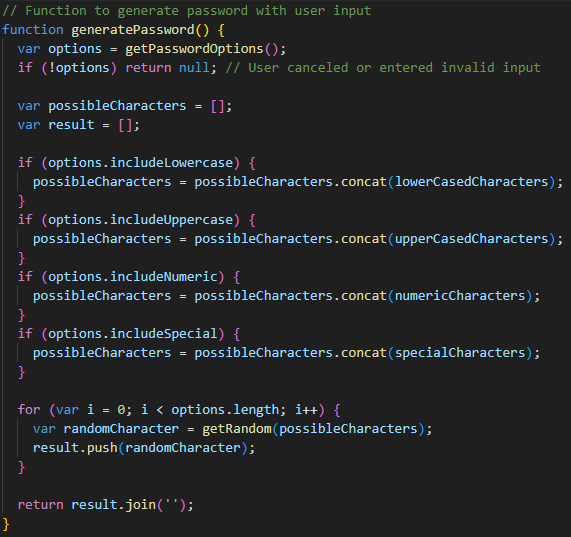
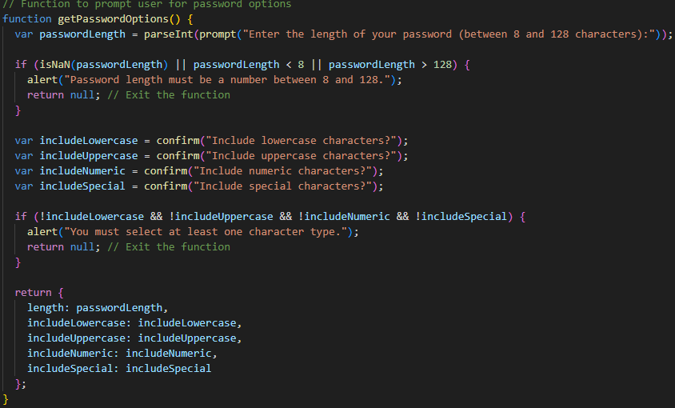
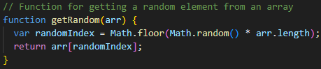

# Password Generator

This challenge is about creating a web application that generates a random password based on user-defined criteria. The application should have a user-friendly interface and should be responsive to different screen sizes. The password can include special characters, and the user can choose from a variety of character types (lowercase, uppercase, numeric, and special characters).

## Table of Contents

+ Demo
+ Instructions
+ Starter Code
+ Refactored Code
+ Usage
+ Features
+ Contributing
+ License

## Demo

A live demo of the Password Generator is available here: [Password Generator](https://nonsoiwedinobi.github.io/Password-Generator/)

## Usage
+ Clone this repository to your local machine.
+ Open the index.html file in a web browser.
+ Click the "Generate Password" button to start generating a password.
+ Follow the prompts to select your desired password criteria.
+ The generated password will be displayed on the page.

## Features
+ User-friendly interface with responsive design.
+ Password user prompt

+ Password length validation.

+ User selection of character types (lowercase, uppercase, numeric, special characters).
+ Error handling for invalid input.
+ Random password generation.

## Contributing
Contributions to this project are welcome. If you have any improvements or suggestions, please create a pull request.

+ Fork the project.
+ Create your feature branch: git checkout -b feature/my-feature.
+ Commit your changes: git commit -m 'Add my feature'.
+ Push to the branch: git push origin feature/my-feature.
+ Submit a pull request.

## License

This project is licensed under the MIT License - see the LICENSE file for details.